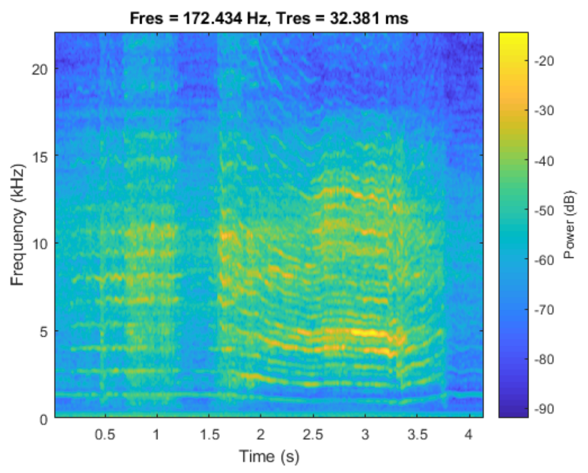

import demo_video from './cardinalsim-audio/drill_audio.mp4';

### Overview

As a research assistant, I worked with the University of Calgary’s VT2 Lab and ENT surgeons from the Surgical Innovation Group at the Ohlson Research Initiative. I liaised closely with the surgical team to understand their needs and enhance the CardinalSim surgical simulation platform accordingly. My first major contribution in this role was improving multimodal feedback for key surgical tools. The simulator modeled two fundamental drill types commonly used in temporal bone procedures: cutting bits and diamond bits, each with distinct characteristics that were important to simulate accurately.

### Problem and Goal

CardinalSim enables surgeons to rehearse complex temporal bone procedures in a safe and controlled virtual environment. This benefits both the rehearsal of patient-specific anatomy and training for surgical students. These surgeries involve using high-speed drills to navigate a delicate 3D space filled with critical structures like nerves, blood vessels, and the cochlea. Simulating this kind of procedure calls for not just visual and tactile realism, but also accurate sound. Sound provides valuable cues about the pressure and density of the bone the drill is in contact with, which surgeons use to identify features within the temporal bone, such as the tegmen.

I was responsible for developing the support for audio output, creating realistic, tool-dependent audio feedback that responded dynamically to drill pressure.

### Solution Design

The drill’s audio feedback was composed of multiple sound states:

- **Idle** — looping motor whirr with no bone contact  
- **Engaged – Diamond or Cutting bit** — a looped recording with pressure-dependent modulation  
- **Spin-up / Spin-down** — quick fades in and out during activation or stopping  

Audio playback was managed by tracking the bit type, haptic device output force, and drill state in real time. The system responded by playing the appropriate audio loop.

The audio files were constructed from recordings of real drilling on a representative medium. I began by isolating clean spin-up and spin-down audio snippets. The idle and engaged states required seamless looping, so I carefully selected sections of the recordings that could loop without noticeable artifacts.

The final challenge was pressure responsiveness in the engaged loops. To model this, I analyzed the recordings using windowed spectral decomposition to examine how pitch changed with force. This approach revealed a clear pitch drop as drill pressure increased. Based on the spectral data, I estimated that a 4N increase in pressure resulted in a 15% drop in pitch.

*Spectral analysis of drill audio under increasing pressure demonstrating pitch shift, used to estimate a realistic relationship between force and pitch shift in the simulation.*

### Result

By the end of the project, the audio system supported multiple drill states with distinct character and responsiveness. Subjectively, surgeons reported that the audio added realism. The final implementation was efficient, flexible, and integrated cleanly with the rest of the simulator software.

<video controls width="100%">
  <source src={demo_video} />
  Your browser does not support the video tag.
</video>
*A short clip showing the drill in action with dynamic audio feedback during simulated bone contact.*

### What I Learned

This project reinforced how powerful cross-disciplinary collaboration can be. I had to listen closely to expert stakeholders who thought in surgical, not software, terms, and turn those insights into something you could hear and feel. I also deepened my ability to design with performance and clarity in mind, especially in a real-time, high-stakes simulation context.