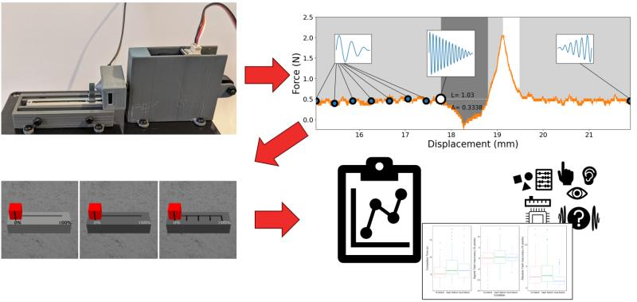
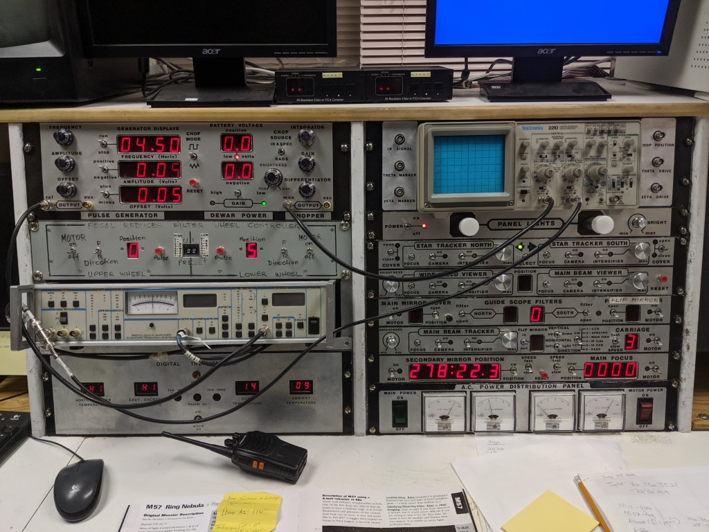
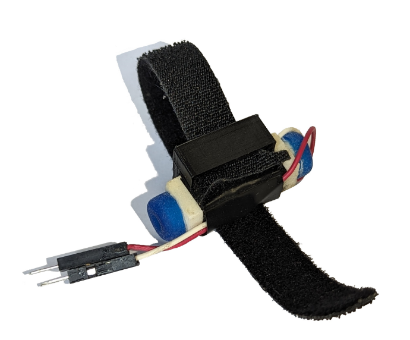

<a href="/projects/msc-thesis/">Previously, I shared a brief post</a> featuring the abstract and linking to the full text of my MSc. thesis. While that version presents the formal academic work, I wanted to follow it up with something more accessible — a professional summary that highlights what I actually did, what I learned, and how the project reflects my strengths as a developer and collaborator.

### Overview
In my thesis, "Vibrotactile Rendering of Sliders in Virtual Reality," I developed a probe to measure key characteristics of mechanical sliders. I collected data using the probe to determine the forces that are produced when the slider is manipulated by a user, and then adapted techniques established by prior research to produce a simulation of that experience using vibrotactile feedback. Finally, I evaluated the simulated sliders through a user study.

*Data collected using the probe was foundational for the simulated sliders that I evaluated through a user study*

### Motivation

This project was part of a broader research effort to explore physical interaction in VR. I focused on simulating sliders because they’re both useful and tactilely appealing — properties that make them promising candidates for haptic simulation. In hands-on VR interaction, tasks like number selection can be difficult; simulating the familiar feel of a physical slider could help make those tasks easier and more satisfying.

*A control panel at the Rothney Astrophysical observatory*

The question, then, was how to simulate that feel using minimal hardware. Our sense of touch relies on several types of mechanoreceptors in the skin. One of them — the Pacinian corpuscle — is especially sensitive to vibration, and it plays a key role in detecting events like a tool contacting a surface or in this case, a slider “clicking” into a detent.

Rather than source a complex device targeting multiple sensory channels, I wanted to approach this problem using simple, accessible, reliable hardware. A small, inexpensive vibration motors called vibrotactile actuators are already used in game controllers and VR systems. 

 

*The MM3C-HF actuator from Tactile Labs is driven by an analogue AC signal. It has a 3D printed mount for a velcro band to affix it to a user’s fingertip.*

If the tactile experience of moving a slider is carried in part through vibration, maybe we could recreate that feeling with simple, widely available hardware.

### Skills and Contributions
##### Ideation, Planning, and Early Development

1.Scoped a complex interaction challenge by identifying sliders as a practical and high-impact use case for simplified haptics in VR. 
1.Conducted a structured investigation of related technologies and prior approaches to inform design decisions. Similar to a competitive landscape review or technical discovery phase.
1.Translated domain research into actionable system requirements and development priorities.
1.Adapted and extended existing algorithms to suit new constraints.
1.Defined success metrics and user-facing goals early, enabling focused development and measurable outcomes; aligned with product thinking in technical roles.
1.Collaborated with a small team to develop underlying simulation platform. We implemented industry-standard software development practices throughout the project, including:
    1.Scrum-based development with iterative planning
    1.Azure DevOps CI/CD pipelines and CMake for build and deployment automation
    1.Enforced Git-based code review policies via protected branches
    1.Internal documentation and custom artifact generation tools to improve process clarity
    
    

##### Hardware Prototyping

<ul>
<li>End-to-end development of a custom sensor rig using low-cost, modular components drawing on rapid prototyping and hardware integration skills.</li>
<li>Created thorough documentation to ensure reproducibility and knowledge transfer — applicable to both engineering onboarding and open innovation contexts.</li>
</ul>

![A diagram of the custom probe for measuring the force-displacement profiles of sliders. The components of the probe are numbered and identified 1. The host computer (out of picture). 2. The digital oscilloscope (out of picture). 3. The linear actuator. 4. The force sensor. 5. The slider to be measured. The figure indicates relationships between the components. The computer controls the linear actuator. The digital oscilloscope reports logs to the computer. The output of the force sensor is logged by the digital oscilloscope. The linear actuator moves the target slider. The target slider pushes the force sensor.](./msc-thesis-detail/images/diagram_force_probe.png)
*The probe is made up of two major systems: sensing and actuation. The physical components that make up the probe are shown in the probe assembly block in orange.*

<ul>
<li>Designed mechanical components (3D-printed mounts, linear guide systems) to ensure consistency and usability.</li>
<li>Iterated on 3D-printed mechanical components to ensure precision, stability, and ease of use.</li>
</ul>

![A photo of the custom probe for measuring the force-displacement profiles of sliders. It has several 3d printed jigs holding off-the-shelf components that are grouped in colored boxes.The red box indicates the actuaton group containing components 1 and 3, the computer and linear actuator. The green box indicates the sensing group containing components 1, 2, and 5, the computer, oscilloscope, and force sensor. The orange box indicates the physical probe assembly, containging components 3, 4, and 5, the linear actuator, target slider, and force sensor.](./msc-thesis-detail/images/annotated_force_probe.png)

##### Spatial Computing

<ul>
    <li>Built and deployed an interactive VR interface using direct hand-based manipulation, illustrating fluency in immersive UI/UX design.</li>
    <li>Analyzed large datasets from probe characterization experiments to inform critical tactile features of sliders for haptic feedback algorithm using Python, matplotlib, seaborn, and pandas.</li>
</ul>    
   
 
*An illustrative representation of the output of the simulation overlayed on the real force curve recorded by the probe created using Python. The slider produced a stable force through most of its range, but a large spike when passing the detent. The haptic feedback produces "grain" signals to simulate friction, and larger pulses to simulate the detent and contact with the end of the slider range.*
   
<ul>
    <li>Developed a haptic feedback system that rendered event-driven haptic feedback in real-time (1000Hz).</li>
    <li>Generalized feedback techniques to support various physical input metaphors (sliders, knobs, switches), emphasizing extensibility and interface abstraction.</li>
    <li>Focused on perceptual fidelity and responsiveness, key to both user-centric product development and simulation fidelity in training or testing environments.</li>
    <li>Wrote synchronized logging systems to reliably capture interaction data for visibility, testing, and evaluation.</li>
</ul>

##### Research, Data, and Evaluation

<ul>
    <li>Designed and executed a small-scale mixed-method study, balancing quantitative and qualitative insights, comparable to usability testing or customer research.</li>
    <li>Refined study protocols through pilot testing; a methodical approach to validation and iterative design.</li>
    <li>Analyzed user behavior and system performance using structured metrics (task accuracy, completion time), akin to product analytics or UX evaluation.</li>
    <li>Used R for data analysis and visualization.</li>
    <li>Conducted qualitative coding and thematic analysis of interview data. Transferable to customer insight synthesis, journey mapping, or voice-of-the-user research.</li>
    <li>Communicated results with a blend of data visualizations, technical writing, and plain-language summaries for academic and non-academic audiences — reflecting stakeholder-focused reporting and technical communication.</li>
</ul>

### What I Learned
An in-depth, end-to-end project like this was a huge learning experience in ideation, problem solving, communication, and a host of technical skills. 

My master's research gave me a ton of confidence when approaching open-ended problems and communicating across disciplines. I had to make sense of messy physical data, translate that into a working simulation, and build tools to help others understand and evaluate what I made. That meant balancing rigor with creativity, and diving deep into both code and hardware to bring the idea to life.

It reinforced my appreciation for the value of structure in collaborative work; using real development processes like code reviews, CI/CD, and backlog planning kept our small team aligned and made the technical side of the project much smoother. I had already been a long-time Git user and I was very excited to build on that skill and finally try out all the buttons on our provider's sidebar. 

Just as important, I got to experiment with and learn a ton of technologies, tools, concepts, and resources. You can check out my <a href="/">work history</a> for industry-relevant highlights, but there are of course many interesting things that had to be left out of that document. For example, working with the leapmotion controller was an instructive experience on computer vision-based user interfaces. Alongside VR, it was a rare and fascinating opportunity to consider users' biomechanics in relation to software; the bones of the virtual hands of my simulator are actually scaled to match each user.

If you're interested in collaborating, learning more, or seeing related work, feel free to reach out.
